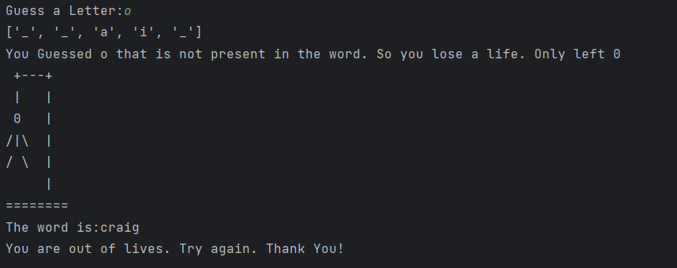

# **First Project**

This is my first project with git. 

# Overview
This is version of the classic letter guessing game called Hangman. You are shown a set of blank letters that match a word or phrase and you have to guess what these letters are to reveal the hidden word. You guess by picking letters from those displayed on the sides. If you pick a letter that is in the word, a sound is played and that letter is revealed from the blank letters; however, if you pick a letter that is not in the word, then a stickman is slowly drawn. With each wrong letter guess, the man is drawn more and more. When the man is finished, he is hung and the game is lost. This is why the game is called 'Hangman'.

# _Let's play Hangman!!_

- A few facts to remember!

 A row of dashes represents the word to guess. If the player guesses a letter in the word, the script writes it in all its correct positions.  The player has 6 turns to guess the word. You can easily customize the game by changing the variables.

## Instructions

1. Open index.html in your browser to get an idea of Hangman game.


* You can code your own hangman game to play with you friends.
1. 

* Download the dictionary file and open file for reading. 
---
```python
import random


def load_words_from_file(file_path):
    with open(file_path, "r") as file:
        words = [line.strip() for line in file]
    return words
```
* Generate random word from the dictionary
```python
def generate_random_word(word_list):
    return random.choice(word_list)


# Specify the path to your dictionary file
dictionary_file_path = "dictionary.txt"
# Load words from the dictionary file
word_list = load_words_from_file(dictionary_file_path)
random_word = generate_random_word(word_list)
```
* Rest of the part

```python
word = []
print("Let's play Hangman!!. \nYou have only 6 lives so try to guess the word within 6 attempts! Good luck!!")
for i in range(len(random_word)):
    word += "_"
print(word)

life = 6
index = -1
while life < 7:
    guess = input("Guess a Letter:")
    for letter in random_word:
        index += 1
        if guess == letter:
            word[index] = guess
        else:
            pass
    else:
        print(word)
        
    index = -1
    if guess not in word:
        life += (-1)
        print(f"You Guessed {guess} that is not present in the word. So you lose a life. Only left {life}")
        if life == 5:
            print(" +---+\n |   |\n 0   |\n     |\n     |\n     |\n========")
        elif life == 4:
            print(" +---+\n |   |\n 0   |\n |   |\n     |\n     |\n========")
        elif life == 3:
            print(" +---+\n |   |\n 0   |\n/|   |\n     |\n     |\n========")
        elif life == 2:
            print(" +---+\n |   |\n 0   |\n/|\  |\n     |\n     |\n========")
        elif life == 1:
            print(" +---+\n |   |\n 0   |\n/|\  |\n/    |\n     |\n========")
        else:
            print(" +---+\n |   |\n 0   |\n/|\  |\n/ \  |\n     |\n========")
            print(f"The word is:{random_word}")
            print("You are out of lives. Try again. Thank You!")

            break

    if word.count("_") == 0:
        print("You Win!")
        print(f"Tou have correctly guess the {random_word}")
        break
```
[Hangman python code](https://github.com/Sachanee/My-first-project/blob/main/hangman.py)

* Now you can run your own Hangman game!!.


# Outputs



